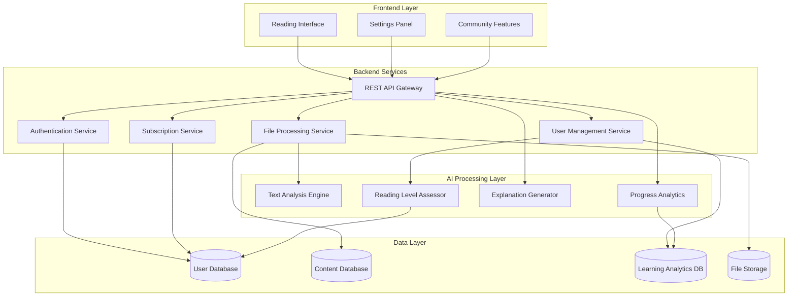
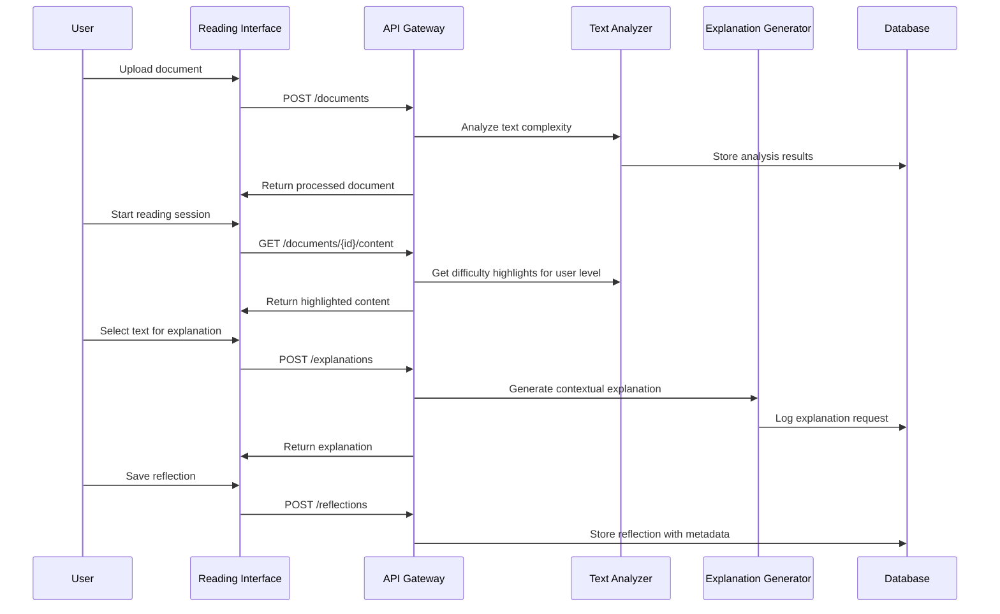
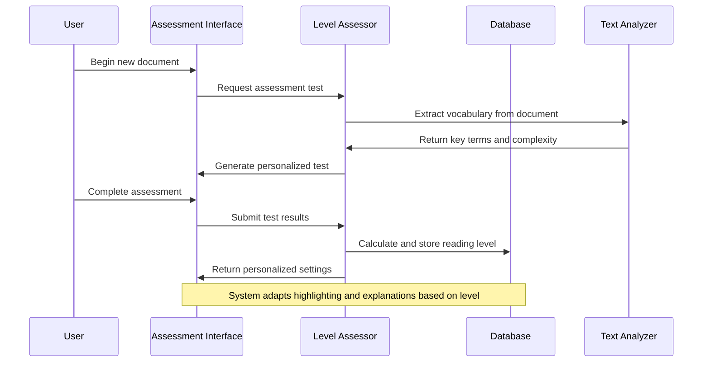
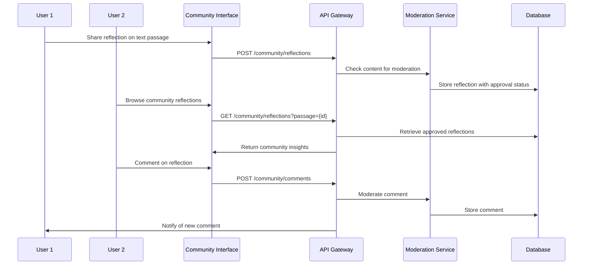
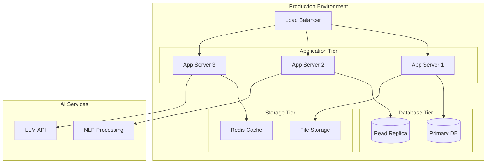

# Design Document

## Overview

The AI Reader Agent is a web-based application that provides personalized reading assistance through AI-powered text analysis, contextual explanations, and adaptive learning features. The system uses natural language processing to assess user reading levels, highlight difficult content, and provide contextual explanations while maintaining a personal learning database for progress tracking.

## Architecture

The system follows a modular, service-oriented architecture with clear separation between frontend presentation, backend services, and AI processing components. The architecture is designed with extensibility in mind to support future multi-language capabilities while currently focusing on English language processing.

### High-Level Architecture



## Components and Interfaces

### Frontend Components

#### Reading Interface

- **Purpose**: Primary reading experience with text display, highlighting, and interaction features
- **Key Features**:
  - Text rendering with automatic highlighting
  - Selection-based explanation requests
  - Discussion panel integration
  - Progress indicators
- **Technology**: React/Vue.js with responsive design
- **Interfaces**: Communicates with Backend API for content retrieval and AI services

#### Settings Panel

- **Purpose**: User preference management and customization
- **Key Features**:
  - Explanation frequency controls
  - Highlighting sensitivity adjustment
  - Learning pace preferences
  - Privacy settings for community features
- **Interfaces**: REST API calls to User Service

#### Community Features

- **Purpose**: Social learning and reflection sharing
- **Key Features**:
  - Reflection posting and viewing
  - Comment system
  - Content moderation
  - Privacy controls
- **Interfaces**: Community API endpoints with authentication

### Backend Services

#### File Processing Service

- **Purpose**: Handle file uploads, text extraction, and content preparation
- **Key Functions**:
  - File validation and security scanning
  - Text extraction from various formats
  - Content preprocessing for AI analysis
  - Metadata extraction and storage
- **Interfaces**:
  - REST endpoints for file upload
  - Integration with Text Analysis Engine
  - File storage system integration

#### User Management Service

- **Purpose**: User profiles, preferences, and learning data management
- **Key Functions**:
  - User authentication and authorization
  - Profile management
  - Learning preference storage
  - Progress data aggregation
- **Interfaces**:
  - Authentication endpoints
  - User profile CRUD operations
  - Integration with Learning Analytics DB

#### Subscription Service

- **Purpose**: Manage user subscription tiers and feature access control
- **Key Functions**:
  - Subscription tier validation
  - Feature access enforcement
  - Usage tracking and limits
  - Payment processing integration
  - Subscription lifecycle management
- **Interfaces**:
  - Subscription management API
  - Feature access validation endpoints
  - Integration with payment providers
  - Usage monitoring and reporting

#### AI Processing Services

##### Text Analysis Engine

- **Purpose**: Core NLP processing for content analysis
- **Key Functions**:
  - Vocabulary complexity assessment
  - Sentence structure analysis
  - Context extraction
  - Difficulty scoring
  - Language detection and processing
- **Technology**: Python-based NLP pipeline using spaCy/NLTK with English language models (extensible for future multi-language support)
- **Language Support**: Currently English only, with architecture designed for future expansion to support additional languages
- **Interfaces**: Internal API for other services with language-agnostic endpoints

##### Reading Level Assessor

- **Purpose**: Determine user reading proficiency and adapt content accordingly
- **Key Functions**:
  - Initial assessment test generation
  - Reading level calculation
  - Adaptive difficulty adjustment
  - Progress-based level updates
- **Technology**: Machine learning models for text complexity analysis
- **Interfaces**: Assessment API endpoints

##### Explanation Generator

- **Purpose**: Generate contextual explanations for selected text
- **Key Functions**:
  - Context-aware explanation generation
  - Cultural and linguistic context consideration
  - Explanation complexity adaptation
  - Multi-modal explanation support
- **Technology**: Large Language Model integration (OpenAI GPT/Claude)
- **Interfaces**: Real-time explanation API

## User Roles and Permissions Design

### Role Hierarchy

```typescript
enum UserRole {
  READER = "reader", // Standard users who read and learn
  MODERATOR = "moderator", // Community content moderation
  ADMIN = "admin", // System administration
  SUPER_ADMIN = "super_admin", // Full system access
}

interface UserPermissions {
  // Content Management
  canUploadFiles: boolean;
  canDeleteOwnFiles: boolean;
  canShareReflections: boolean;
  canViewCommunityContent: boolean;

  // Community Features
  canModerateComments: boolean;
  canReportContent: boolean;
  canBanUsers: boolean;

  // System Administration
  canManageUsers: boolean;
  canViewAnalytics: boolean;
  canManageSubscriptions: boolean;
  canAccessSystemLogs: boolean;
}
```

### Permission Matrix by Role and Subscription

| Permission          | Free Reader | Normal Reader | Pro Reader | Plus Reader | Moderator | Admin     |
| ------------------- | ----------- | ------------- | ---------- | ----------- | --------- | --------- |
| Upload Files (max)  | 5           | 50            | 200        | Unlimited   | Unlimited | Unlimited |
| AI Explanations/day | 10          | 100           | 500        | Unlimited   | Unlimited | Unlimited |
| Community Access    | View Only   | Full          | Full       | Full        | Full      | Full      |
| Share Reflections   | ❌          | ✅            | ✅         | ✅          | ✅        | ✅        |
| Advanced Analytics  | ❌          | ❌            | ✅         | ✅          | ✅        | ✅        |
| Priority Support    | ❌          | ❌            | ❌         | ✅          | ✅        | ✅        |
| Moderate Content    | ❌          | ❌            | ❌         | ❌          | ✅        | ✅        |
| User Management     | ❌          | ❌            | ❌         | ❌          | ❌        | ✅        |

## Data Flow Logic

### Reading Session Flow



### User Assessment Flow



### Community Interaction Flow



## Feature Development Priorities

### Phase 1: Core Reading Experience (MVP)

**Priority: Critical - 3 months**

- [ ] Basic file upload and text display
- [ ] Simple text highlighting based on common word lists
- [ ] Basic AI explanations for selected text
- [ ] User registration and basic profiles
- [ ] Reading level assessment (simplified)

**Success Criteria**: Users can upload a text file, get basic explanations, and see their reading progress

### Phase 2: Personalization and Learning (3-6 months)

**Priority: High**

- [ ] Advanced NLP text analysis pipeline
- [ ] Personalized difficulty scoring
- [ ] Learning progress tracking
- [ ] Reflection saving and retrieval
- [ ] Subscription tiers and payment integration
- [ ] Improved AI explanations with context

**Success Criteria**: System adapts to individual users and tracks learning progress effectively

### Phase 3: Community and Social Features (6-9 months)

**Priority: Medium**

- [ ] Community reflection sharing
- [ ] Comment and discussion system
- [ ] Content moderation tools
- [ ] User roles and permissions
- [ ] Advanced analytics dashboard
- [ ] Mobile-responsive design improvements

**Success Criteria**: Active community engagement with quality discussions and effective moderation

### Phase 4: Advanced Features and Expansion (9-12 months)

**Priority: Low**

- [ ] PDF and EPUB file support
- [ ] Advanced reading analytics
- [ ] Gamification elements
- [ ] API for third-party integrations
- [ ] Performance optimizations
- [ ] Accessibility improvements

**Success Criteria**: Comprehensive reading platform with broad file support and excellent performance

### Phase 5: Multi-Language Support (12+ months)

**Priority: Future**

- [ ] Spanish language support
- [ ] French language support
- [ ] Language-specific NLP models
- [ ] Cross-language learning features
- [ ] Localized user interfaces
- [ ] Cultural context adaptation

**Success Criteria**: Successfully support multiple languages with culturally appropriate explanations

### Technical Debt and Infrastructure (Ongoing)

**Priority: Continuous**

- [ ] Security audits and improvements
- [ ] Performance monitoring and optimization
- [ ] Database scaling and optimization
- [ ] Automated testing coverage
- [ ] Documentation and developer tools
- [ ] Backup and disaster recovery

## Data Models

### User Model

```typescript
interface User {
  id: string;
  email: string;
  profile: UserProfile;
  preferences: UserPreferences;
  readingLevel: ReadingLevel;
  subscription: UserSubscription;
  createdAt: Date;
  updatedAt: Date;
}

interface UserSubscription {
  tier: "free" | "normal" | "pro" | "plus";
  status: "active" | "expired" | "cancelled";
  startDate: Date;
  endDate?: Date;
  features: SubscriptionFeatures;
}

interface SubscriptionFeatures {
  maxDocuments: number;
  maxFileSize: number; // in MB
  aiExplanationsPerDay: number;
  communityAccess: boolean;
  advancedAnalytics: boolean;
  prioritySupport: boolean;
  customizationLevel: "basic" | "advanced" | "premium";
}

interface UserProfile {
  name: string;
  nativeLanguage: string;
  targetLanguage: string; // Currently supports 'en' (English), extensible for future languages
  learningGoals: string[];
}

interface UserPreferences {
  explanationFrequency: number; // 1-5 repetitions
  explanationDepth: "basic" | "detailed" | "comprehensive";
  highlightSensitivity: "low" | "medium" | "high";
  communityParticipation: boolean;
}

interface ReadingLevel {
  vocabularyScore: number;
  comprehensionScore: number;
  overallLevel: "beginner" | "intermediate" | "advanced";
  lastAssessed: Date;
}
```

### Content Model

```typescript
interface Document {
  id: string;
  userId: string;
  title: string;
  content: string;
  metadata: DocumentMetadata;
  analysisData: TextAnalysis;
  uploadedAt: Date;
}

interface DocumentMetadata {
  fileType: string;
  fileSize: number;
  wordCount: number;
  estimatedReadingTime: number;
  genre?: string;
  language: string; // Currently 'en' for English, designed for future multi-language expansion
  detectedLanguage?: string; // Auto-detected language for validation
}

interface TextAnalysis {
  vocabularyComplexity: number;
  sentenceComplexity: number;
  topicalKeywords: string[];
  difficultPhrases: DifficultPhrase[];
}

interface DifficultPhrase {
  text: string;
  startIndex: number;
  endIndex: number;
  difficultyScore: number;
  category: "vocabulary" | "idiom" | "grammar" | "cultural";
}
```

### Learning Data Model

```typescript
interface LearningSession {
  id: string;
  userId: string;
  documentId: string;
  startTime: Date;
  endTime?: Date;
  wordsLearned: string[];
  explanationsRequested: ExplanationRequest[];
  reflections: Reflection[];
  progressMetrics: ProgressMetrics;
}

interface ExplanationRequest {
  text: string;
  explanation: string;
  timestamp: Date;
  userRating?: number;
}

interface Reflection {
  id: string;
  content: string;
  isPublic: boolean;
  textReference: string;
  timestamp: Date;
  communityEngagement?: CommunityEngagement;
}

interface ProgressMetrics {
  readingSpeed: number; // words per minute
  comprehensionAccuracy: number;
  vocabularyGrowth: number;
  engagementLevel: number;
}
```

## Error Handling

### File Processing Errors

- **Invalid File Format**: Return clear error message with supported formats
- **File Size Exceeded**: Provide size limits and suggest compression
- **Corrupted Files**: Attempt recovery, fallback to manual upload guidance
- **Processing Timeout**: Queue for background processing with status updates

### AI Service Errors

- **API Rate Limits**: Implement exponential backoff and user notification
- **Service Unavailable**: Graceful degradation with cached explanations
- **Invalid Responses**: Fallback to simpler explanation methods
- **Context Too Large**: Chunk processing with context preservation

### User Experience Errors

- **Network Connectivity**: Offline mode with local caching
- **Authentication Failures**: Clear re-authentication flows
- **Data Synchronization**: Conflict resolution with user choice
- **Performance Issues**: Progressive loading and optimization

### Data Integrity

- **Database Failures**: Transaction rollback and data recovery
- **Concurrent Updates**: Optimistic locking with conflict resolution
- **Data Migration**: Versioned schemas with backward compatibility
- **Backup Failures**: Multiple backup strategies with monitoring

## Testing Strategy

### Unit Testing

- **Component Testing**: Individual React components with Jest and React Testing Library
- **Service Testing**: Backend services with comprehensive mock data
- **AI Model Testing**: NLP pipeline accuracy and performance benchmarks
- **Database Testing**: Data model validation and query optimization

### Integration Testing

- **API Testing**: End-to-end API workflows with realistic data
- **AI Integration**: Text analysis and explanation generation accuracy
- **File Processing**: Various file formats and edge cases
- **User Workflow**: Complete user journeys from upload to learning

### Performance Testing

- **Load Testing**: Concurrent user scenarios and system limits
- **AI Response Time**: Explanation generation speed benchmarks
- **File Processing**: Large file handling and processing time
- **Database Performance**: Query optimization and indexing validation

### User Acceptance Testing

- **Usability Testing**: Reading experience and interface intuitiveness
- **Learning Effectiveness**: Vocabulary retention and comprehension improvement
- **Accessibility Testing**: Screen reader compatibility and keyboard navigation
- **Cross-Platform Testing**: Browser compatibility and responsive design

### Security Testing

- **Authentication**: User session management and access controls
- **File Upload Security**: Malicious file detection and sanitization
- **Data Privacy**: Personal learning data protection and GDPR compliance
- **API Security**: Rate limiting, input validation, and injection prevention

## Performance Requirements and User Scale

### Target User Scale

- **Year 1**: 1,000-5,000 active users
- **Year 2**: 10,000-25,000 active users
- **Year 3**: 50,000-100,000 active users
- **Peak Concurrent Users**: 10% of active user base
- **Geographic Distribution**: Initially English-speaking markets (US, UK, Canada, Australia)

### Performance Requirements

#### Response Time Targets

- **File Upload**: < 5 seconds for files up to 10MB
- **Text Analysis**: < 3 seconds for documents up to 50,000 words
- **AI Explanations**: < 2 seconds for contextual explanations
- **Page Load**: < 1 second for reading interface
- **Search/Filter**: < 500ms for user content searches

#### Throughput Requirements

- **API Requests**: 1,000 requests/second peak
- **File Processing**: 100 concurrent file uploads
- **AI Explanations**: 500 explanations/minute
- **Database Operations**: 5,000 queries/second

#### Availability and Reliability

- **Uptime**: 99.5% availability (4.4 hours downtime/month)
- **Data Durability**: 99.999% (five 9s)
- **Backup Recovery**: < 4 hours RTO, < 1 hour RPO
- **Disaster Recovery**: Multi-region failover capability

## Deployment Environment and Cost Budget

### Deployment Architecture



### Infrastructure Requirements

#### Cloud Platform: AWS (Primary Choice)

- **Compute**: EC2 instances (t3.medium to c5.xlarge)
- **Database**: RDS PostgreSQL with read replicas
- **Storage**: S3 for file storage, EBS for application data
- **CDN**: CloudFront for global content delivery
- **Load Balancing**: Application Load Balancer
- **Caching**: ElastiCache Redis
- **Monitoring**: CloudWatch + custom dashboards

#### Alternative: Google Cloud Platform

- **Compute**: Compute Engine or Cloud Run
- **Database**: Cloud SQL PostgreSQL
- **Storage**: Cloud Storage
- **CDN**: Cloud CDN
- **AI Services**: Vertex AI for NLP processing

### Cost Budget Estimates (Monthly)

#### Year 1 (1K-5K users)

- **Compute**: $200-500/month (2-3 app servers)
- **Database**: $150-300/month (RDS with backup)
- **Storage**: $50-150/month (user files + backups)
- **AI Services**: $300-800/month (OpenAI/Claude API)
- **CDN/Networking**: $50-100/month
- **Monitoring/Tools**: $100-200/month
- **Total**: $850-2,050/month

#### Year 2 (10K-25K users)

- **Compute**: $800-1,500/month (auto-scaling)
- **Database**: $400-800/month (larger instances + replicas)
- **Storage**: $200-500/month
- **AI Services**: $1,500-3,000/month
- **CDN/Networking**: $150-300/month
- **Monitoring/Tools**: $200-400/month
- **Total**: $3,250-6,500/month

#### Year 3 (50K-100K users)

- **Compute**: $2,000-4,000/month
- **Database**: $1,000-2,000/month
- **Storage**: $500-1,000/month
- **AI Services**: $5,000-10,000/month
- **CDN/Networking**: $300-600/month
- **Monitoring/Tools**: $400-800/month
- **Total**: $9,200-18,400/month

## Third-Party Service Integration Requirements

### AI and NLP Services

```typescript
interface AIServiceIntegration {
  // Primary LLM Provider
  openai: {
    models: ["gpt-4", "gpt-3.5-turbo"];
    usage: "contextual explanations, discussions";
    fallback: "claude-3-sonnet";
  };

  // NLP Processing
  spacy: {
    models: ["en_core_web_lg"];
    usage: "text analysis, difficulty scoring";
    deployment: "self-hosted";
  };

  // Language Detection
  langdetect: {
    usage: "automatic language identification";
    deployment: "self-hosted";
  };
}
```

### Payment Processing

- **Primary**: Stripe for subscription management
- **Features**: Recurring billing, proration, webhooks
- **Compliance**: PCI DSS Level 1
- **Integration**: Stripe Customer Portal for self-service

### Authentication and Security

- **Auth Provider**: Auth0 or AWS Cognito
- **Social Login**: Google, Apple, Microsoft
- **MFA**: TOTP, SMS backup
- **Session Management**: JWT with refresh tokens

### Email and Communications

- **Email Service**: SendGrid or AWS SES
- **Use Cases**: Welcome emails, notifications, password resets
- **Templates**: Responsive HTML templates
- **Analytics**: Open rates, click tracking

### Monitoring and Analytics

- **Application Monitoring**: DataDog or New Relic
- **Error Tracking**: Sentry
- **User Analytics**: Mixpanel or Amplitude
- **Performance**: Custom dashboards + alerts

### File Processing

- **Image Processing**: Cloudinary (future PDF support)
- **Document Conversion**: Apache Tika (self-hosted)
- **Virus Scanning**: ClamAV or cloud-based solution

## Data Security and Privacy Requirements

### Data Classification

```typescript
enum DataSensitivity {
  PUBLIC = "public", // Community reflections (with consent)
  INTERNAL = "internal", // Usage analytics, system logs
  CONFIDENTIAL = "confidential", // User profiles, reading progress
  RESTRICTED = "restricted", // Payment info, personal identifiers
}
```

### Security Controls by Data Type

#### User Authentication Data (RESTRICTED)

- **Encryption**: bcrypt for passwords, AES-256 for PII
- **Storage**: Separate encrypted database
- **Access**: Admin-only with audit logging
- **Retention**: Account lifetime + 30 days after deletion

#### Reading Content and Progress (CONFIDENTIAL)

- **Encryption**: AES-256 at rest, TLS 1.3 in transit
- **Access Control**: User-owned data only
- **Backup**: Encrypted backups with 7-year retention
- **Anonymization**: Remove PII for analytics after 2 years

#### Community Content (INTERNAL/PUBLIC)

- **Moderation**: AI + human review before publication
- **User Control**: Granular privacy settings
- **Right to Delete**: Complete removal within 30 days
- **Content Licensing**: Clear terms for shared reflections

### Privacy Compliance

#### GDPR Compliance (EU Users)

- **Legal Basis**: Legitimate interest for learning analytics
- **Consent Management**: Granular consent for community features
- **Data Portability**: Export all user data in JSON format
- **Right to Erasure**: Complete account deletion within 30 days
- **Data Processing Records**: Detailed logging of all data operations

#### CCPA Compliance (California Users)

- **Privacy Notice**: Clear disclosure of data collection
- **Opt-Out Rights**: Easy opt-out from data sales (N/A for our model)
- **Data Access**: User dashboard showing all collected data
- **Non-Discrimination**: No service degradation for privacy choices

#### COPPA Compliance (Under 13 Users)

- **Age Verification**: Require parental consent
- **Data Minimization**: Collect only essential data
- **Parental Controls**: Parent dashboard for account management
- **Marketing Restrictions**: No behavioral advertising to minors

### Security Architecture

#### Infrastructure Security

- **Network**: VPC with private subnets, WAF protection
- **Access Control**: IAM roles with least privilege
- **Secrets Management**: AWS Secrets Manager or HashiCorp Vault
- **Vulnerability Scanning**: Automated security scans

#### Application Security

- **Input Validation**: Strict validation on all user inputs
- **SQL Injection**: Parameterized queries, ORM usage
- **XSS Protection**: Content Security Policy, input sanitization
- **CSRF Protection**: Anti-CSRF tokens on all forms
- **Rate Limiting**: API rate limits per user/IP

#### Data Security

- **Encryption Keys**: Hardware Security Modules (HSM)
- **Key Rotation**: Automatic rotation every 90 days
- **Audit Logging**: All data access logged and monitored
- **Data Loss Prevention**: Automated scanning for PII leaks

### Incident Response Plan

1. **Detection**: Automated alerts + 24/7 monitoring
2. **Assessment**: Security team response within 1 hour
3. **Containment**: Isolate affected systems within 2 hours
4. **Notification**: User notification within 72 hours (GDPR)
5. **Recovery**: Full service restoration plan
6. **Lessons Learned**: Post-incident review and improvements

## Technology Stack Selection and Rationale

### Frontend Technology Stack

#### Primary Framework: React with TypeScript

**Rationale**:

- Large ecosystem and community support
- Excellent TypeScript integration for type safety
- Rich component libraries (Material-UI, Ant Design)
- Strong performance with virtual DOM
- Extensive testing tools and documentation

**Alternative Considered**: Vue.js

- Pros: Easier learning curve, good performance
- Cons: Smaller ecosystem, less enterprise adoption

#### State Management: Redux Toolkit + RTK Query

**Rationale**:

- Predictable state management for complex reading interface
- RTK Query handles API caching and synchronization
- DevTools for debugging user interactions
- Scales well with application complexity

#### Styling: Tailwind CSS + Headless UI

**Rationale**:

- Utility-first approach for rapid development
- Consistent design system
- Small bundle size with purging
- Accessibility-first components with Headless UI

#### Build Tool: Vite

**Rationale**:

- Fast development server and hot module replacement
- Optimized production builds
- Native ES modules support
- Better developer experience than Webpack

### Backend Technology Stack

#### Runtime: Node.js with Express.js

**Rationale**:

- JavaScript/TypeScript consistency across stack
- Large ecosystem of packages
- Excellent async I/O performance
- Strong community and documentation
- Easy integration with AI/ML services

**Alternative Considered**: Python with FastAPI

- Pros: Better ML/NLP library ecosystem
- Cons: Additional language complexity, deployment overhead

#### Database: PostgreSQL with Prisma ORM

**Rationale**:

- ACID compliance for user data integrity
- JSON support for flexible document storage
- Full-text search capabilities
- Prisma provides type-safe database access
- Excellent performance and scalability

#### Caching: Redis

**Rationale**:

- In-memory performance for frequent queries
- Session storage and rate limiting
- Pub/sub for real-time features
- Persistent storage options

#### Authentication: Auth0

**Rationale**:

- Enterprise-grade security
- Social login integrations
- Multi-factor authentication
- Compliance with security standards
- Reduces development and maintenance overhead

### AI/ML Technology Stack

#### NLP Processing: Python with spaCy

**Rationale**:

- Production-ready performance
- Pre-trained language models
- Extensible pipeline architecture
- Strong community and documentation

#### LLM Integration: OpenAI API with Claude fallback

**Rationale**:

- State-of-the-art explanation quality
- Reliable API with good uptime
- Cost-effective for our use case
- Claude provides good fallback option

#### Text Analysis: Custom Python microservice

**Rationale**:

- Specialized processing for reading difficulty
- Can be scaled independently
- Easier to optimize and maintain
- Language-specific optimizations

## Database Schema Design

### Core Tables Structure

```sql
-- Users and Authentication
CREATE TABLE users (
    id UUID PRIMARY KEY DEFAULT gen_random_uuid(),
    email VARCHAR(255) UNIQUE NOT NULL,
    auth0_id VARCHAR(255) UNIQUE NOT NULL,
    created_at TIMESTAMP DEFAULT NOW(),
    updated_at TIMESTAMP DEFAULT NOW()
);

CREATE TABLE user_profiles (
    id UUID PRIMARY KEY DEFAULT gen_random_uuid(),
    user_id UUID REFERENCES users(id) ON DELETE CASCADE,
    name VARCHAR(255) NOT NULL,
    native_language VARCHAR(10) DEFAULT 'en',
    target_language VARCHAR(10) DEFAULT 'en',
    learning_goals TEXT[],
    created_at TIMESTAMP DEFAULT NOW(),
    updated_at TIMESTAMP DEFAULT NOW()
);

CREATE TABLE user_subscriptions (
    id UUID PRIMARY KEY DEFAULT gen_random_uuid(),
    user_id UUID REFERENCES users(id) ON DELETE CASCADE,
    tier VARCHAR(20) NOT NULL CHECK (tier IN ('free', 'normal', 'pro', 'plus')),
    status VARCHAR(20) NOT NULL CHECK (status IN ('active', 'expired', 'cancelled')),
    start_date TIMESTAMP NOT NULL,
    end_date TIMESTAMP,
    stripe_subscription_id VARCHAR(255),
    created_at TIMESTAMP DEFAULT NOW(),
    updated_at TIMESTAMP DEFAULT NOW()
);

-- Reading Level and Preferences
CREATE TABLE reading_levels (
    id UUID PRIMARY KEY DEFAULT gen_random_uuid(),
    user_id UUID REFERENCES users(id) ON DELETE CASCADE,
    vocabulary_score INTEGER NOT NULL CHECK (vocabulary_score >= 0 AND vocabulary_score <= 100),
    comprehension_score INTEGER NOT NULL CHECK (comprehension_score >= 0 AND comprehension_score <= 100),
    overall_level VARCHAR(20) NOT NULL CHECK (overall_level IN ('beginner', 'intermediate', 'advanced')),
    last_assessed TIMESTAMP DEFAULT NOW(),
    created_at TIMESTAMP DEFAULT NOW()
);

CREATE TABLE user_preferences (
    id UUID PRIMARY KEY DEFAULT gen_random_uuid(),
    user_id UUID REFERENCES users(id) ON DELETE CASCADE,
    explanation_frequency INTEGER DEFAULT 3 CHECK (explanation_frequency >= 1 AND explanation_frequency <= 5),
    explanation_depth VARCHAR(20) DEFAULT 'basic' CHECK (explanation_depth IN ('basic', 'detailed', 'comprehensive')),
    highlight_sensitivity VARCHAR(20) DEFAULT 'medium' CHECK (highlight_sensitivity IN ('low', 'medium', 'high')),
    community_participation BOOLEAN DEFAULT false,
    created_at TIMESTAMP DEFAULT NOW(),
    updated_at TIMESTAMP DEFAULT NOW()
);

-- Documents and Content
CREATE TABLE documents (
    id UUID PRIMARY KEY DEFAULT gen_random_uuid(),
    user_id UUID REFERENCES users(id) ON DELETE CASCADE,
    title VARCHAR(500) NOT NULL,
    content TEXT NOT NULL,
    file_type VARCHAR(50) NOT NULL,
    file_size INTEGER NOT NULL,
    word_count INTEGER NOT NULL,
    estimated_reading_time INTEGER NOT NULL, -- in minutes
    genre VARCHAR(100),
    language VARCHAR(10) DEFAULT 'en',
    detected_language VARCHAR(10),
    uploaded_at TIMESTAMP DEFAULT NOW(),
    created_at TIMESTAMP DEFAULT NOW()
);

CREATE TABLE text_analyses (
    id UUID PRIMARY KEY DEFAULT gen_random_uuid(),
    document_id UUID REFERENCES documents(id) ON DELETE CASCADE,
    vocabulary_complexity DECIMAL(3,2) NOT NULL CHECK (vocabulary_complexity >= 0 AND vocabulary_complexity <= 10),
    sentence_complexity DECIMAL(3,2) NOT NULL CHECK (sentence_complexity >= 0 AND sentence_complexity <= 10),
    topical_keywords TEXT[],
    analysis_version VARCHAR(20) DEFAULT '1.0',
    created_at TIMESTAMP DEFAULT NOW()
);

CREATE TABLE difficult_phrases (
    id UUID PRIMARY KEY DEFAULT gen_random_uuid(),
    text_analysis_id UUID REFERENCES text_analyses(id) ON DELETE CASCADE,
    text VARCHAR(500) NOT NULL,
    start_index INTEGER NOT NULL,
    end_index INTEGER NOT NULL,
    difficulty_score DECIMAL(3,2) NOT NULL CHECK (difficulty_score >= 0 AND difficulty_score <= 10),
    category VARCHAR(20) NOT NULL CHECK (category IN ('vocabulary', 'idiom', 'grammar', 'cultural')),
    created_at TIMESTAMP DEFAULT NOW()
);

-- Learning Sessions and Progress
CREATE TABLE learning_sessions (
    id UUID PRIMARY KEY DEFAULT gen_random_uuid(),
    user_id UUID REFERENCES users(id) ON DELETE CASCADE,
    document_id UUID REFERENCES documents(id) ON DELETE CASCADE,
    start_time TIMESTAMP DEFAULT NOW(),
    end_time TIMESTAMP,
    words_learned TEXT[],
    reading_speed INTEGER, -- words per minute
    comprehension_accuracy DECIMAL(3,2),
    vocabulary_growth INTEGER DEFAULT 0,
    engagement_level DECIMAL(3,2),
    created_at TIMESTAMP DEFAULT NOW()
);

CREATE TABLE explanation_requests (
    id UUID PRIMARY KEY DEFAULT gen_random_uuid(),
    learning_session_id UUID REFERENCES learning_sessions(id) ON DELETE CASCADE,
    text VARCHAR(1000) NOT NULL,
    explanation TEXT NOT NULL,
    user_rating INTEGER CHECK (user_rating >= 1 AND user_rating <= 5),
    response_time_ms INTEGER,
    created_at TIMESTAMP DEFAULT NOW()
);

-- Community Features
CREATE TABLE reflections (
    id UUID PRIMARY KEY DEFAULT gen_random_uuid(),
    user_id UUID REFERENCES users(id) ON DELETE CASCADE,
    learning_session_id UUID REFERENCES learning_sessions(id) ON DELETE CASCADE,
    content TEXT NOT NULL,
    text_reference VARCHAR(1000),
    is_public BOOLEAN DEFAULT false,
    moderation_status VARCHAR(20) DEFAULT 'pending' CHECK (moderation_status IN ('pending', 'approved', 'rejected')),
    created_at TIMESTAMP DEFAULT NOW(),
    updated_at TIMESTAMP DEFAULT NOW()
);

CREATE TABLE reflection_comments (
    id UUID PRIMARY KEY DEFAULT gen_random_uuid(),
    reflection_id UUID REFERENCES reflections(id) ON DELETE CASCADE,
    user_id UUID REFERENCES users(id) ON DELETE CASCADE,
    content TEXT NOT NULL,
    moderation_status VARCHAR(20) DEFAULT 'pending' CHECK (moderation_status IN ('pending', 'approved', 'rejected')),
    created_at TIMESTAMP DEFAULT NOW()
);
```

### Indexing Strategy

```sql
-- Performance indexes
CREATE INDEX idx_users_email ON users(email);
CREATE INDEX idx_users_auth0_id ON users(auth0_id);
CREATE INDEX idx_documents_user_id ON documents(user_id);
CREATE INDEX idx_documents_uploaded_at ON documents(uploaded_at DESC);
CREATE INDEX idx_learning_sessions_user_document ON learning_sessions(user_id, document_id);
CREATE INDEX idx_reflections_public_approved ON reflections(is_public, moderation_status) WHERE is_public = true AND moderation_status = 'approved';

-- Full-text search indexes
CREATE INDEX idx_documents_content_fts ON documents USING gin(to_tsvector('english', content));
CREATE INDEX idx_reflections_content_fts ON reflections USING gin(to_tsvector('english', content));
```

## API Endpoint Planning

### Authentication Endpoints

```typescript
// Auth endpoints
POST / api / auth / login; // Auth0 login callback
POST / api / auth / logout; // Logout and token cleanup
POST / api / auth / refresh; // Refresh JWT token
GET / api / auth / me; // Get current user info
```

### User Management Endpoints

```typescript
// User profile management
GET / api / users / profile; // Get user profile
PUT / api / users / profile; // Update user profile
GET / api / users / preferences; // Get user preferences
PUT / api / users / preferences; // Update user preferences
GET / api / users / reading - level; // Get current reading level
DELETE / api / users / account; // Delete user account (GDPR)

// Subscription management
GET / api / users / subscription; // Get subscription details
POST / api / users / subscription; // Create/update subscription
DELETE / api / users / subscription; // Cancel subscription
```

### Document Management Endpoints

```typescript
// Document CRUD operations
GET    /api/documents               // List user documents (paginated)
POST   /api/documents               // Upload new document
GET    /api/documents/:id           // Get document details
PUT    /api/documents/:id           // Update document metadata
DELETE /api/documents/:id           // Delete document

// Document content and analysis
GET    /api/documents/:id/content   // Get document content with highlights
GET    /api/documents/:id/analysis  // Get text analysis results
POST   /api/documents/:id/reanalyze // Trigger reanalysis
```

### Reading and Learning Endpoints

```typescript
// Reading sessions
POST   /api/reading/sessions        // Start new reading session
PUT    /api/reading/sessions/:id    // Update reading session
GET    /api/reading/sessions/:id    // Get session details
POST   /api/reading/sessions/:id/end // End reading session

// AI explanations
POST   /api/explanations            // Request explanation for text
GET    /api/explanations/history    // Get user's explanation history
PUT    /api/explanations/:id/rating // Rate explanation quality

// Reading level assessment
POST   /api/assessment/start        // Start reading level assessment
POST   /api/assessment/submit       // Submit assessment answers
GET    /api/assessment/results      // Get assessment results
```

### Community Endpoints

```typescript
// Reflections
GET    /api/community/reflections   // Get public reflections (paginated)
POST   /api/community/reflections   // Create new reflection
GET    /api/community/reflections/:id // Get reflection details
PUT    /api/community/reflections/:id // Update own reflection
DELETE /api/community/reflections/:id // Delete own reflection

// Comments
GET    /api/community/reflections/:id/comments // Get reflection comments
POST   /api/community/reflections/:id/comments // Add comment
PUT    /api/community/comments/:id   // Update own comment
DELETE /api/community/comments/:id   // Delete own comment

// Moderation (admin/moderator only)
GET    /api/moderation/queue         // Get content pending moderation
PUT    /api/moderation/approve/:id   // Approve content
PUT    /api/moderation/reject/:id    // Reject content
```

### Analytics and Progress Endpoints

```typescript
// User progress
GET / api / analytics / progress; // Get learning progress overview
GET / api / analytics / vocabulary; // Get vocabulary growth data
GET / api / analytics / reading - speed; // Get reading speed trends
GET / api / analytics / engagement; // Get engagement metrics

// Admin analytics (admin only)
GET / api / admin / analytics / users; // User growth and engagement
GET / api / admin / analytics / content; // Content usage statistics
GET / api / admin / analytics / performance; // System performance metrics
```

### API Design Principles

- **RESTful Design**: Standard HTTP methods and status codes
- **Consistent Response Format**: Standardized JSON response structure
- **Pagination**: Cursor-based pagination for large datasets
- **Rate Limiting**: Per-user and per-endpoint rate limits
- **Versioning**: API versioning strategy for future updates
- **Error Handling**: Consistent error response format with helpful messages

## Frontend Component Structure Strategy

### Component Architecture Overview

```
src/
├── components/           # Reusable UI components
│   ├── ui/              # Basic UI elements (Button, Input, Modal)
│   ├── forms/           # Form components with validation
│   ├── layout/          # Layout components (Header, Sidebar, Footer)
│   └── common/          # Shared business components
├── features/            # Feature-based component organization
│   ├── auth/            # Authentication components
│   ├── documents/       # Document management components
│   ├── reading/         # Reading interface components
│   ├── community/       # Community features
│   └── analytics/       # Progress and analytics components
├── hooks/               # Custom React hooks
├── services/            # API service layer
├── store/               # Redux store configuration
├── types/               # TypeScript type definitions
└── utils/               # Utility functions
```

### Core Feature Components

#### Reading Interface Components

```typescript
// Main reading interface
components/reading/
├── ReadingInterface.tsx     // Main reading container
├── DocumentViewer.tsx       // Text display with highlighting
├── ExplanationPanel.tsx     // Side panel for explanations
├── ProgressIndicator.tsx    // Reading progress tracking
├── HighlightManager.tsx     // Manages text highlighting
├── SelectionHandler.tsx     // Handles text selection events
└── ReadingControls.tsx      // Reading settings and controls

// Reading interface state management
hooks/
├── useTextSelection.ts      // Handle text selection logic
├── useExplanations.ts       // Manage explanation requests
├── useReadingProgress.ts    // Track reading progress
└── useHighlighting.ts       // Manage text highlighting
```

#### Document Management Components

```typescript
components/documents/
├── DocumentLibrary.tsx      // Document list and management
├── DocumentUpload.tsx       // File upload interface
├── DocumentCard.tsx         // Individual document display
├── DocumentSearch.tsx       // Search and filter documents
└── DocumentAnalysis.tsx     // Display analysis results
```

#### Community Components

```typescript
components/community/
├── CommunityFeed.tsx        // Main community interface
├── ReflectionCard.tsx       // Individual reflection display
├── ReflectionForm.tsx       // Create/edit reflections
├── CommentSection.tsx       // Comments for reflections
└── ModerationQueue.tsx      // Content moderation (admin)
```

### State Management Strategy

#### Redux Store Structure

```typescript
store/
├── index.ts                 // Store configuration
├── rootReducer.ts          // Combine all reducers
└── slices/
    ├── authSlice.ts        // Authentication state
    ├── documentsSlice.ts   // Document management state
    ├── readingSlice.ts     // Reading session state
    ├── communitySlice.ts   // Community features state
    ├── preferencesSlice.ts // User preferences state
    └── uiSlice.ts          // UI state (modals, loading, etc.)
```

#### Custom Hooks for Business Logic

```typescript
hooks/
├── useAuth.ts              // Authentication logic
├── useDocuments.ts         // Document management
├── useReading.ts           // Reading session management
├── useCommunity.ts         // Community interactions
├── useAnalytics.ts         // Progress tracking
└── useSubscription.ts      // Subscription management
```

## Deployment and Monitoring Strategy

### Deployment Architecture

#### Production Environment (AWS)

```yaml
# docker-compose.prod.yml
version: "3.8"
services:
  frontend:
    image: ai-reader-frontend:latest
    ports:
      - "80:80"
      - "443:443"
    environment:
      - NODE_ENV=production
      - API_URL=https://api.ai-reader.com

  backend:
    image: ai-reader-backend:latest
    ports:
      - "3000:3000"
    environment:
      - NODE_ENV=production
      - DATABASE_URL=${DATABASE_URL}
      - REDIS_URL=${REDIS_URL}
      - AUTH0_DOMAIN=${AUTH0_DOMAIN}
    depends_on:
      - postgres
      - redis

  nlp-service:
    image: ai-reader-nlp:latest
    ports:
      - "8000:8000"
    environment:
      - PYTHON_ENV=production

  postgres:
    image: postgres:15
    environment:
      - POSTGRES_DB=ai_reader
      - POSTGRES_USER=${DB_USER}
      - POSTGRES_PASSWORD=${DB_PASSWORD}
    volumes:
      - postgres_data:/var/lib/postgresql/data

  redis:
    image: redis:7-alpine
    volumes:
      - redis_data:/data
```

#### CI/CD Pipeline (GitHub Actions)

```yaml
# .github/workflows/deploy.yml
name: Deploy to Production
on:
  push:
    branches: [main]

jobs:
  test:
    runs-on: ubuntu-latest
    steps:
      - uses: actions/checkout@v3
      - name: Run tests
        run: |
          npm ci
          npm run test:coverage
          npm run lint
          npm run type-check

  build-and-deploy:
    needs: test
    runs-on: ubuntu-latest
    steps:
      - name: Build Docker images
        run: |
          docker build -t ai-reader-frontend ./frontend
          docker build -t ai-reader-backend ./backend
          docker build -t ai-reader-nlp ./nlp-service

      - name: Deploy to AWS ECS
        run: |
          aws ecs update-service --cluster ai-reader --service frontend
          aws ecs update-service --cluster ai-reader --service backend
          aws ecs update-service --cluster ai-reader --service nlp-service
```

### Monitoring and Observability

#### Application Monitoring Stack

```typescript
// Monitoring configuration
const monitoring = {
  // Application Performance Monitoring
  apm: {
    service: "DataDog APM",
    metrics: [
      "response_time",
      "error_rate",
      "throughput",
      "database_query_time",
      "ai_service_latency",
    ],
  },

  // Error Tracking
  errorTracking: {
    service: "Sentry",
    features: [
      "error_grouping",
      "performance_monitoring",
      "release_tracking",
      "user_feedback",
    ],
  },

  // Infrastructure Monitoring
  infrastructure: {
    service: "AWS CloudWatch",
    metrics: [
      "cpu_utilization",
      "memory_usage",
      "disk_io",
      "network_traffic",
      "database_connections",
    ],
  },

  // User Analytics
  analytics: {
    service: "Mixpanel",
    events: [
      "document_upload",
      "explanation_request",
      "reflection_created",
      "subscription_upgrade",
    ],
  },
};
```

#### Health Checks and Alerts

```typescript
// Health check endpoints
GET / health; // Basic health check
GET / health / detailed; // Detailed system status
GET / health / database; // Database connectivity
GET / health / ai - services; // AI service availability
GET / health / external - deps; // Third-party service status

// Alert configuration
const alerts = {
  critical: {
    response_time_p95: ">2s",
    error_rate: ">1%",
    database_connections: ">80%",
    disk_usage: ">85%",
  },
  warning: {
    response_time_p95: ">1s",
    error_rate: ">0.5%",
    memory_usage: ">70%",
    ai_service_latency: ">3s",
  },
};
```

#### Logging Strategy

```typescript
// Structured logging configuration
const logging = {
  format: "JSON",
  levels: ["error", "warn", "info", "debug"],
  fields: [
    "timestamp",
    "level",
    "service",
    "user_id",
    "request_id",
    "message",
    "metadata",
  ],
  retention: {
    error_logs: "90_days",
    access_logs: "30_days",
    debug_logs: "7_days",
  },
};
```

This completes the comprehensive design document with all the technical architecture details needed for successful implementation of the AI Reader Agent.
