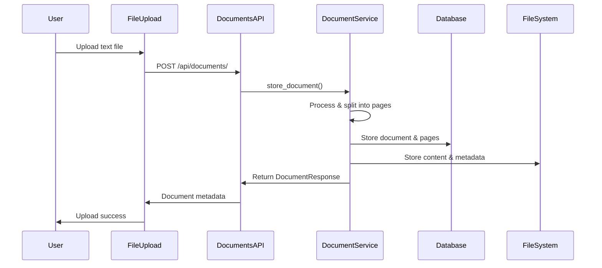
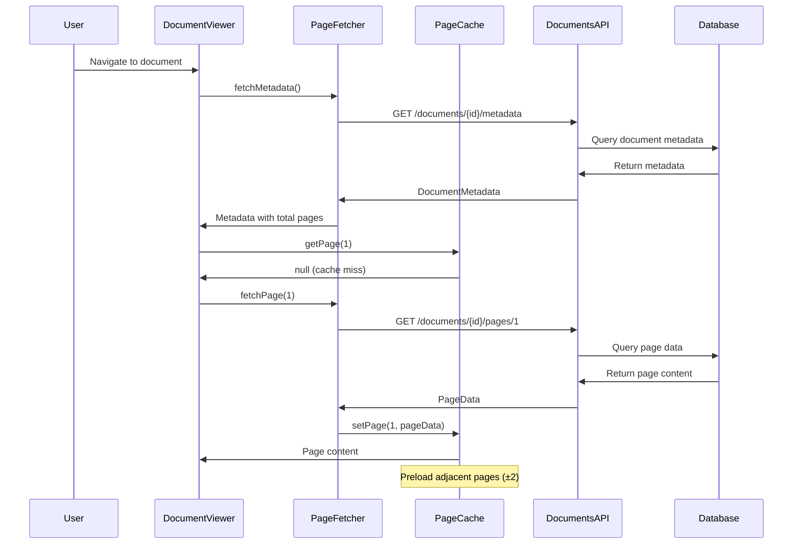
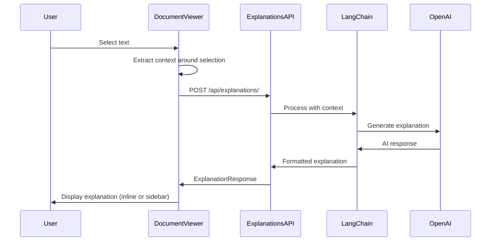
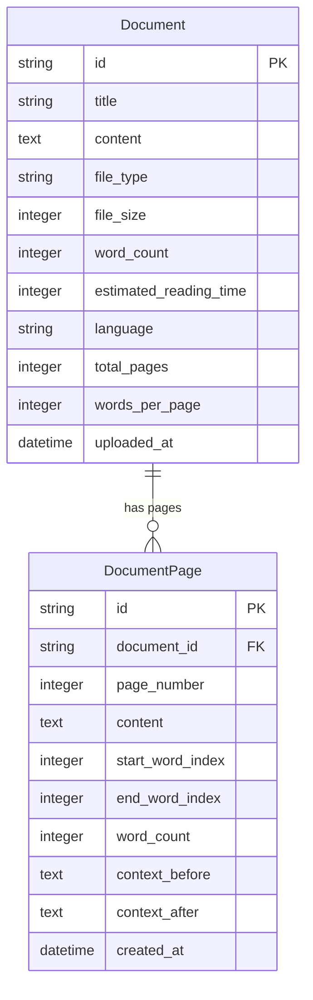

# System Architecture Documentation

## 1. Overview

**AI Reader Agent** is a web application that helps users read text documents with AI-powered explanations. Users can upload a document, navigate through pages, and select text to get context-aware explanations from AI.

The system follows a **three-layer architecture**:  

1. **Frontend** – Handles user interface and interactions  
2. **Backend** – Manages documents, AI requests, and business logic  
3. **Data Layer** – Stores document content, metadata, and communicates with external AI services  

> Think of it as a stack: Frontend talks to Backend, which talks to Data and AI services.

---

## 2. Architecture Diagram

```	
Overall
    UI--> API
    API --> DB
    API --> AI

```
```
Frontend Layer (React TypeScript)
        UI
        ?Router[React Router]
        ?Services[Frontend Services]
        ?Cache[Page Cache Manager]
```
```
Backend Layer (Python FastAPI)"
        API
        Services
        Models
        Database
        Storage
       无 Middleware[CORS & Validation]
    

   

    UI --> Router
    UI --> Services
    Services --> Cache
    Services --> API
    API --> BL
    BL --> Models
    BL --> SQLite
    BL --> FileSystem
    BL --> OpenAI

```

## Three-Tier Architecture

### 1. Frontend Layer (Presentation Tier)


- **DocumentViewer**: Main reading interface with page navigation and text selection
- **FileUpload**: Secure document upload with validation
- **Layout**: Application shell and navigation structure
- **PageFetcher**: Handles API communication with retry logic
- **PageCacheManager**: Implements intelligent page caching with LRU eviction

### 2. Backend Layer (Business Logic Tier)

The backend is built with Python FastAPI, providing a high-performance REST API with automatic documentation and validation.

#### API Structure

- **Documents API** (`/api/documents/`): Document upload, metadata, and page retrieval
- **Explanations API** (`/api/explanations/`): AI-powered text explanations
- **DocumentService**: Core document processing, page splitting, and storage management

### 3. Data Layer (Persistence Tier)

The data layer implements a hybrid storage strategy combining structured database storage with file system storage for optimal performance.

#### Storage Systems

- **SQLite Database**: Structured storage for document metadata and pages
- **File Storage**: Document content and metadata files for backward compatibility


## Component Relationships and Data Flow

### Document Upload Flow



### Document Reading Flow



### AI Explanation Flow




### Storage Systems Integration

#### Dual Storage Strategy

The system implements a dual storage approach for reliability and performance:

1. **Database Storage (Primary)**

   - SQLite database for structured queries
   - Document and DocumentPage tables with relationships
   - Optimized indexes for efficient page retrieval

2. **File System Storage (Backup)**
   - JSON metadata files for backward compatibility
   - Text content files for direct access
   - Organized directory structure

#### Database Schema



## Scalability Considerations(带扩展)


### Horizontal Scaling Strategies

#### Database Scaling

- **Read Replicas**: SQLite can be replaced with PostgreSQL for read replicas
- **Sharding**: Documents can be sharded by ID or user for large datasets
- **Caching Layer**: Redis can be added for distributed caching

#### Application Scaling

- **Load Balancing**: Multiple FastAPI instances behind a load balancer
- **Microservices**: Document processing and AI services can be separated
- **CDN Integration**: Static assets and cached content via CDN

#### External Service Scaling

- **AI Service Redundancy**: Multiple AI providers for failover
- **Rate Limiting**: Implement rate limiting for API protection
- **Async Processing**: Queue-based processing for heavy operations

### Monitoring and Observability

#### Logging Strategy

- **Structured Logging**: JSON-formatted logs for better parsing
- **Error Tracking**: Comprehensive error logging with context
- **Performance Metrics**: Response times and cache hit rates

#### Health Checks

- **Database Health**: Connection and query performance monitoring
- **External Service Health**: OpenAI API availability and response times
- **Application Health**: Memory usage and request processing metrics

## Security Architecture（面试之前可看）

### Input Validation and Sanitization

#### File Upload Security

- **MIME Type Validation**: Strict text/plain enforcement
- **File Size Limits**: 10MB maximum to prevent resource exhaustion
- **Content Validation**: UTF-8 encoding verification
- **Extension Filtering**: Only .txt files allowed

#### API Security

- **Request Validation**: Pydantic models for all API inputs
- **SQL Injection Prevention**: SQLAlchemy ORM with parameterized queries
- **XSS Prevention**: Proper output encoding in React components

### CORS Configuration

The backend implements proper CORS configuration:

- **Origin Restrictions**: Only frontend URL allowed
- **Method Restrictions**: Only necessary HTTP methods enabled
- **Credential Handling**: Secure credential transmission

### Data Protection

#### Storage Security

- **File Permissions**: Proper file system permissions for document storage
- **Database Security**: SQLite file permissions and access control
- **Sensitive Data**: Environment variables for API keys and configuration

#### Privacy Considerations

- **Data Retention**: Clear policies for document storage duration
- **User Content**: Secure handling of uploaded documents
- **AI Service Privacy**: Consideration of data sent to external AI services

## Development and Deployment Architecture

### Development Environment

#### Local Development Setup

- **Frontend**: Vite development server with hot reload
- **Backend**: Uvicorn with auto-reload for development
- **Database**: Local SQLite file for development
- **Environment**: Docker Compose for consistent development environment

#### Build Process

- **Frontend Build**: TypeScript compilation and Vite bundling
- **Backend Packaging**: Python package with dependencies
- **Static Assets**: Optimized CSS and JavaScript bundles

### Deployment Considerations

#### Production Architecture

- **Reverse Proxy**: Nginx for static file serving and load balancing
- **Application Server**: Gunicorn with Uvicorn workers for production
- **Database**: PostgreSQL for production scalability
- **File Storage**: Cloud storage (S3) for document files

#### Infrastructure as Code

- **Containerization**: Docker containers for consistent deployment
- **Orchestration**: Kubernetes or Docker Compose for service management
- **CI/CD Pipeline**: Automated testing and deployment

This architecture provides a solid foundation for the AI Reader Agent application with clear separation of concerns, scalable design patterns, and comprehensive integration strategies. The modular design allows for future enhancements and scaling as the application grows.
