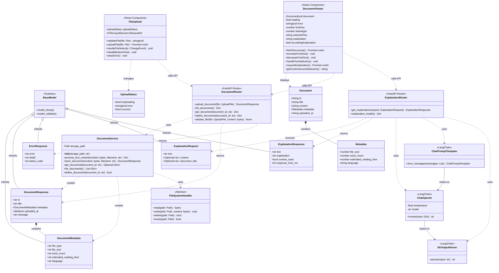

# UML Class Diagram - AI Reader Agent

## Current Architecture

## Enhanced Architecture with Full OOP Concepts

This diagram shows how the system could be enhanced to demonstrate all OOP principles:

## OOP Concepts Demonstrated

### 1. **Inheritance**

- `DocumentMetadata`, `DocumentResponse`, `ErrorResponse` inherit from Pydantic's `BaseModel`
- `TextDocumentProcessor`, `PDFDocumentProcessor`, `MarkdownDocumentProcessor` inherit from `DocumentProcessor`
- `FileSystemStorage`, `DatabaseStorage`, `CloudStorage` inherit from `StorageHandler`
- `TextDocument`, `StructuredDocument` inherit from `BaseDocument`

### 2. **Abstraction**

- `DocumentProcessor` - abstract base class defining interface for document processing
- `StorageHandler` - abstract base class for storage operations
- `BaseDocument` - abstract base class for document models
- These classes define contracts that concrete implementations must follow

### 3. **Polymorphism**

- `EnhancedDocumentService` can work with any `DocumentProcessor` implementation
- Storage operations work with any `StorageHandler` implementation
- Different document types can be processed through the same interface
- Factory pattern allows runtime selection of appropriate processor

### 4. **Overriding**

- Each concrete processor overrides `process()`, `validate()`, and `extract_metadata()`
- Each storage implementation overrides `save()`, `load()`, `delete()`, `list_all()`
- Document types override `get_summary()` with type-specific implementations

### 5. **Overloading** (Simulated in Python)

- `DocumentValidator` demonstrates method overloading through default parameters
- Python uses `@overload` decorator for type hints (not shown in diagram)
- Multiple signatures for `validate()` method

### 6. **File Processing**

- `FileSystemStorage` - saves/loads documents to/from hard drive
- `DocumentService.store_document()` - writes content and metadata files
- `DocumentService.get_document()` - reads files from storage
- Uses Python's `Path` and file I/O operations (`open()`, `read()`, `write()`)

## Current Implementation Notes

The current codebase demonstrates:

- ✅ **File Processing**: Full implementation in `DocumentService`
- ✅ **Basic Inheritance**: Through Pydantic models
- ⚠️ **Limited Abstraction**: No abstract base classes yet
- ⚠️ **Limited Polymorphism**: Single document processor type
- ❌ **No Overloading**: Python doesn't support traditional overloading
- ❌ **No Overriding**: No inheritance hierarchy to override

## Recommendations for Enhancement

To fully demonstrate all OOP concepts, consider:

1. **Add Abstract Base Classes** for document processors and storage handlers
2. **Implement Multiple Document Types** (PDF, Markdown, DOCX processors)
3. **Create Storage Abstraction** to support different storage backends
4. **Add Factory Pattern** for creating appropriate processors
5. **Implement Method Overloading** using `@overload` decorator and `functools.singledispatch`
6. **Create Document Type Hierarchy** with overridden methods
