# UML Class Diagram - AI Reader Agent

## Current Architecture (Complete Implementation)

```mermaid
classDiagram
    %% ========== PYDANTIC MODELS (Inheritance from BaseModel) ==========
    class BaseModel {
        <<Pydantic Abstract>>
        +model_dump() Dict
        +model_validate(obj: Any) Self
        +model_json() str
    }

    class DocumentMetadata {
        +str file_type
        +int file_size
        +int word_count
        +int estimated_reading_time
        +str language
    }

    class DocumentResponse {
        +str id
        +str title
        +DocumentMetadata metadata
        +datetime uploaded_at
        +str message
    }

    class DocumentMetadataResponse {
        +str id
        +str title
        +int total_pages
        +int total_words
        +int words_per_page
        +datetime uploaded_at
    }

    class PageDataResponse {
        +int page_number
        +str content
        +int start_word_index
        +int end_word_index
        +int word_count
        +str context_before
        +str context_after
    }

    class ErrorResponse {
        +str error
        +str detail
        +int status_code
    }

    class ExplanationRequest {
        +str text
        +Optional~str~ context
    }

    class ExplanationResponse {
        +str text
        +str explanation
        +bool context_used
        +int response_time_ms
    }

    %% ========== SQLALCHEMY DATABASE MODELS (Inheritance from Base) ==========
    class Base {
        <<SQLAlchemy Abstract>>
        +metadata
        +__tablename__
    }

    class Document {
        <<SQLAlchemy Model>>
        +str id PK
        +str title
        +Text content
        +str file_type
        +int file_size
        +int word_count
        +int estimated_reading_time
        +str language
        +int total_pages
        +int words_per_page
        +datetime uploaded_at
        +List~DocumentPage~ pages
    }

    class DocumentPage {
        <<SQLAlchemy Model>>
        +str id PK
        +str document_id FK
        +int page_number
        +Text content
        +int start_word_index
        +int end_word_index
        +int word_count
        +Text context_before
        +Text context_after
        +datetime created_at
        +Document document
    }

    %% ========== SERVICE LAYER (Business Logic) ==========
    class DocumentService {
        <<Service Class>>
        -Path storage_path
        +__init__(storage_path: str)
        +process_text_content(content: bytes, filename: str) Dict
        +split_document_into_pages(content: str, words_per_page: int) List~Dict~
        +calculate_context_windows(pages: List~Dict~, window_size: int) List~Dict~
        +store_document(content: bytes, filename: str, words_per_page: int) DocumentResponse
        +get_document(document_id: str) Optional~Dict~
        +get_document_metadata(document_id: str) Optional~Dict~
        +get_document_page(document_id: str, page_number: int) Optional~Dict~
    }

    %% ========== API ROUTERS (FastAPI Endpoints) ==========
    class DocumentRouter {
        <<FastAPI Router>>
        +upload_document(file: UploadFile) DocumentResponse
        +get_document_metadata(document_id: str) DocumentMetadataResponse
        +get_document_page(document_id: str, page_number: int) PageDataResponse
        +get_document(document_id: str) Dict
        -validate_file(file: UploadFile, content: bytes) None
    }

    class ExplanationRouter {
        <<FastAPI Router>>
        +get_explanation(request: ExplanationRequest) ExplanationResponse
    }

    %% ========== LANGCHAIN COMPONENTS (Polymorphism & Chaining) ==========
    class ChatOpenAI {
        <<LangChain Model>>
        -float temperature
        -str model
        +invoke(input: Dict) str
    }

    class ChatPromptTemplate {
        <<LangChain>>
        +from_messages(messages: List) ChatPromptTemplate
        +invoke(input: Dict) str
    }

    class StrOutputParser {
        <<LangChain>>
        +parse(output: str) str
        +invoke(input: str) str
    }

    %% ========== DATABASE MANAGEMENT ==========
    class SessionLocal {
        <<SQLAlchemy SessionMaker>>
        +query(model: Type) Query
        +add(instance: Any) void
        +commit() void
        +rollback() void
        +close() void
    }

    class Engine {
        <<SQLAlchemy Engine>>
        +connect() Connection
        +execute(statement: str) Result
    }

    %% ========== INHERITANCE RELATIONSHIPS ==========
    BaseModel <|-- DocumentMetadata : inherits
    BaseModel <|-- DocumentResponse : inherits
    BaseModel <|-- DocumentMetadataResponse : inherits
    BaseModel <|-- PageDataResponse : inherits
    BaseModel <|-- ErrorResponse : inherits
    BaseModel <|-- ExplanationRequest : inherits
    BaseModel <|-- ExplanationResponse : inherits

    Base <|-- Document : inherits
    Base <|-- DocumentPage : inherits

    %% ========== COMPOSITION & AGGREGATION ==========
    DocumentResponse *-- DocumentMetadata : contains
    Document "1" *-- "many" DocumentPage : has pages
    DocumentPage --> Document : belongs to

    %% ========== DEPENDENCIES & USAGE ==========
    DocumentService ..> DocumentResponse : creates
    DocumentService ..> DocumentMetadata : creates
    DocumentService ..> Document : persists
    DocumentService ..> DocumentPage : persists
    DocumentService ..> SessionLocal : uses

    DocumentRouter ..> DocumentService : uses
    DocumentRouter ..> DocumentResponse : returns
    DocumentRouter ..> DocumentMetadataResponse : returns
    DocumentRouter ..> PageDataResponse : returns
    DocumentRouter ..> ErrorResponse : returns

    ExplanationRouter ..> ExplanationRequest : receives
    ExplanationRouter ..> ExplanationResponse : returns
    ExplanationRouter ..> ChatOpenAI : uses
    ExplanationRouter ..> ChatPromptTemplate : uses
    ExplanationRouter ..> StrOutputParser : uses

    %% ========== LANGCHAIN PIPELINE (Polymorphism) ==========
    ChatPromptTemplate --|> ChatOpenAI : chains to
    ChatOpenAI --|> StrOutputParser : chains to

    %% ========== DATABASE CONNECTIONS ==========
    SessionLocal ..> Engine : created from
    SessionLocal ..> Document : queries
    SessionLocal ..> DocumentPage : queries

    %% ========== NOTES ==========
    note for BaseModel "Pydantic BaseModel provides:\n- Data validation\n- Serialization\n- Type checking"
    note for Base "SQLAlchemy Base provides:\n- ORM mapping\n- Table creation\n- Relationship management"
    note for DocumentService "Handles:\n- File I/O operations\n- Document processing\n- Page splitting\n- Context calculation"
```



## Enhanced Architecture with Full OOP Concepts

This diagram shows how the system could be enhanced to demonstrate all OOP principles:

```mermaid
classDiagram
    %% Abstract Base Classes (Abstraction)
    class DocumentProcessor {
        <<abstract>>
        +process(content: bytes, filename: str)* Dict
        +validate(content: bytes)* bool
        +extract_metadata(content: bytes)* DocumentMetadata
        #calculate_reading_time(word_count: int) int
    }

    class StorageHandler {
        <<abstract>>
        -Path base_path
        +save(id: str, content: Any)* bool
        +load(id: str)* Optional~Any~
        +delete(id: str)* bool
        +list_all()* List
        #ensure_directory_exists(path: Path) void
    }

    %% Concrete Implementations (Inheritance & Polymorphism)
    class TextDocumentProcessor {
        -str encoding
        +process(content: bytes, filename: str) Dict
        +validate(content: bytes) bool
        +extract_metadata(content: bytes) DocumentMetadata
        +count_words(text: str) int
        +detect_language(text: str) str
    }

    class PDFDocumentProcessor {
        -bool extract_images
        +process(content: bytes, filename: str) Dict
        +validate(content: bytes) bool
        +extract_metadata(content: bytes) DocumentMetadata
        +extract_text_from_pdf(content: bytes) str
        +get_page_count(content: bytes) int
    }

    class MarkdownDocumentProcessor {
        -bool preserve_formatting
        +process(content: bytes, filename: str) Dict
        +validate(content: bytes) bool
        +extract_metadata(content: bytes) DocumentMetadata
        +parse_markdown(text: str) str
        +extract_headers(text: str) List~str~
    }

    %% Storage Implementations (Polymorphism)
    class FileSystemStorage {
        -Path storage_path
        +save(id: str, content: Any) bool
        +load(id: str) Optional~Any~
        +delete(id: str) bool
        +list_all() List
        -get_file_path(id: str) Path
    }

    class DatabaseStorage {
        -str connection_string
        -Connection db_connection
        +save(id: str, content: Any) bool
        +load(id: str) Optional~Any~
        +delete(id: str) bool
        +list_all() List
        -execute_query(query: str) Any
    }

    class CloudStorage {
        -str bucket_name
        -str api_key
        +save(id: str, content: Any) bool
        +load(id: str) Optional~Any~
        +delete(id: str) bool
        +list_all() List
        -upload_to_cloud(id: str, content: Any) bool
    }

    %% Service Layer with Dependency Injection
    class EnhancedDocumentService {
        -DocumentProcessor processor
        -StorageHandler content_storage
        -StorageHandler metadata_storage
        +__init__(processor: DocumentProcessor, content_storage: StorageHandler, metadata_storage: StorageHandler)
        +process_and_store(content: bytes, filename: str) DocumentResponse
        +retrieve_document(document_id: str) Optional~Dict~
        +list_all_documents() List~Dict~
        +remove_document(document_id: str) bool
        +set_processor(processor: DocumentProcessor) void
    }

    %% Factory Pattern (Polymorphism)
    class DocumentProcessorFactory {
        <<factory>>
        +create_processor(file_type: str) DocumentProcessor
        +register_processor(file_type: str, processor_class: Type) void
        -processors: Dict~str, Type~
    }

    %% Models with Inheritance
    class BaseDocument {
        <<abstract>>
        +str id
        +str title
        +datetime created_at
        +datetime updated_at
        +get_summary()* str
        +to_dict() Dict
    }

    class TextDocument {
        +str content
        +int word_count
        +str language
        +get_summary() str
        +get_preview(length: int) str
    }

    class StructuredDocument {
        +List~Section~ sections
        +Dict~str, Any~ metadata
        +get_summary() str
        +get_table_of_contents() List~str~
    }

    class Section {
        +str title
        +str content
        +int level
        +List~Section~ subsections
    }

    %% Method Overloading Simulation (Python doesn't have true overloading)
    class DocumentValidator {
        +validate(content: bytes) bool
        +validate(content: bytes, file_type: str) bool
        +validate(content: bytes, file_type: str, max_size: int) bool
        +validate_with_schema(content: bytes, schema: Dict) bool
    }

    %% Relationships - Inheritance
    DocumentProcessor <|-- TextDocumentProcessor : inherits
    DocumentProcessor <|-- PDFDocumentProcessor : inherits
    DocumentProcessor <|-- MarkdownDocumentProcessor : inherits

    StorageHandler <|-- FileSystemStorage : inherits
    StorageHandler <|-- DatabaseStorage : inherits
    StorageHandler <|-- CloudStorage : inherits

    BaseDocument <|-- TextDocument : inherits
    BaseDocument <|-- StructuredDocument : inherits

    %% Relationships - Composition & Aggregation
    EnhancedDocumentService o-- DocumentProcessor : uses (polymorphism)
    EnhancedDocumentService o-- StorageHandler : uses (polymorphism)
    StructuredDocument *-- Section : contains
    Section *-- Section : recursive composition

    %% Relationships - Dependencies
    DocumentProcessorFactory ..> DocumentProcessor : creates
    EnhancedDocumentService ..> DocumentResponse : returns
    EnhancedDocumentService ..> BaseDocument : manages

    %% Override Examples
    note for TextDocumentProcessor "Overrides:\n- process()\n- validate()\n- extract_metadata()"
    note for FileSystemStorage "Overrides:\n- save()\n- load()\n- delete()\n- list_all()"
    note for TextDocument "Overrides:\n- get_summary()"
```



## OOP Concepts Demonstrated in Current Implementation

### 1. ✅ **Inheritance**

**Pydantic Models (Data Validation Layer):**

- `DocumentMetadata` inherits from `BaseModel`
- `DocumentResponse` inherits from `BaseModel`
- `DocumentMetadataResponse` inherits from `BaseModel`
- `PageDataResponse` inherits from `BaseModel`
- `ErrorResponse` inherits from `BaseModel`
- `ExplanationRequest` inherits from `BaseModel`
- `ExplanationResponse` inherits from `BaseModel`

**SQLAlchemy Models (Database Layer):**

- `Document` inherits from `Base` (SQLAlchemy declarative base)
- `DocumentPage` inherits from `Base`

**Benefits Demonstrated:**

- Code reuse through inherited methods (`model_dump()`, `model_validate()`)
- Consistent interface across all data models
- Automatic validation and serialization from parent classes

### 2. ✅ **Abstraction**

**Pydantic BaseModel (Abstract Interface):**

- Provides abstract interface for data validation
- Defines contract for serialization/deserialization
- Hides implementation details of validation logic

**SQLAlchemy Base (Abstract ORM):**

- Abstracts database operations
- Hides SQL query complexity
- Provides declarative interface for table definitions

**Service Layer Abstraction:**

- `DocumentService` abstracts file I/O and database operations
- Hides complexity of document processing from API layer
- Provides clean interface: `store_document()`, `get_document()`, etc.

### 3. ✅ **Polymorphism**

**LangChain Pipeline (Runtime Polymorphism):**

- `ChatPromptTemplate`, `ChatOpenAI`, and `StrOutputParser` all implement `invoke()` method
- Components can be chained together: `prompt | model | parser`
- Each component processes input differently but follows same interface

**Database Session (Polymorphic Queries):**

- `SessionLocal.query()` works with any SQLAlchemy model
- Same interface for querying `Document` or `DocumentPage`
- Demonstrates polymorphic behavior through ORM

**Method Polymorphism:**

- `DocumentService` methods accept different parameter combinations
- `store_document(content, filename)` vs `store_document(content, filename, words_per_page)`
- Python's duck typing enables polymorphic behavior

### 4. ✅ **Overloading** (Python-style)

**Method Overloading via Default Parameters:**

```python
# DocumentService demonstrates overloading through default parameters
split_document_into_pages(content: str, words_per_page: int = 500)
calculate_context_windows(pages: List, window_size: int = 100)
store_document(content: bytes, filename: str, words_per_page: int = 500)
```

**Multiple Method Signatures:**

- `get_document(document_id)` - returns full document
- `get_document_metadata(document_id)` - returns only metadata
- `get_document_page(document_id, page_number)` - returns single page

**Operator Overloading (LangChain):**

- LangChain uses `|` operator for chaining: `prompt | model | parser`
- Demonstrates operator overloading for pipeline construction

### 5. ✅ **Overriding**

**Pydantic Model Overriding:**

- Each model class overrides `BaseModel` methods implicitly
- Custom field definitions override base behavior
- Validation rules override default validation

**SQLAlchemy Model Overriding:**

- `Document` and `DocumentPage` override `Base.__tablename__`
- Custom column definitions override base table structure
- Relationship definitions override default foreign key behavior

**Method Overriding in Service:**

- `DocumentService.__init__()` overrides default constructor
- Custom initialization logic for storage paths

### 6. ✅ **File Processing (Loading & Saving to Hard Drive)**

**File Writing Operations:**

```python
# Content storage (backend/app/services/document_service.py)
content_file = self.storage_path / "content" / f"{document_id}.txt"
with open(content_file, 'w', encoding='utf-8') as f:
    f.write(text_content)

# Metadata storage
metadata_file = self.storage_path / "metadata" / f"{document_id}.json"
with open(metadata_file, 'w', encoding='utf-8') as f:
    json.dump(document_data, f, indent=2)
```

**File Reading Operations:**

```python
# Load metadata
with open(metadata_file, 'r', encoding='utf-8') as f:
    metadata = json.load(f)

# Load content
with open(content_file, 'r', encoding='utf-8') as f:
    content = f.read()
```

**Database File Operations:**

- SQLite database stored at: `storage/database/documents.db`
- Persistent storage of documents and pages
- CRUD operations through SQLAlchemy ORM

**Directory Management:**

```python
self.storage_path.mkdir(parents=True, exist_ok=True)
(self.storage_path / "content").mkdir(exist_ok=True)
(self.storage_path / "metadata").mkdir(exist_ok=True)
```

### 7. ✅ **Exception Catching**

**API Layer Exception Handling:**

```python
# In documents.py
try:
    content = await file.read()
    validate_file(file, content)
    document_response = document_service.store_document(content, file.filename)
    return document_response
except HTTPException:
    raise  # Re-raise HTTP exceptions
except Exception as e:
    raise HTTPException(
        status_code=status.HTTP_500_INTERNAL_SERVER_ERROR,
        detail=f"Upload failed: {str(e)}"
    )
```

**Database Exception Handling:**

```python
# In document_service.py
db = SessionLocal()
try:
    db_document = Document(...)
    db.add(db_document)
    db.commit()
except Exception as e:
    db.rollback()
    raise e
finally:
    db.close()
```

**Validation Exception Handling:**

```python
try:
    content.decode('utf-8')
except UnicodeDecodeError:
    raise HTTPException(
        status_code=status.HTTP_400_BAD_REQUEST,
        detail="File must contain valid UTF-8 text"
    )
```

## Summary of OOP Implementation

| Concept                | Implementation                                                                                 | Location                                                                        |
| ---------------------- | ---------------------------------------------------------------------------------------------- | ------------------------------------------------------------------------------- |
| **Inheritance**        | Pydantic models inherit from `BaseModel`<br>SQLAlchemy models inherit from `Base`              | `backend/app/models/*.py`<br>`backend/app/models/db_models.py`                  |
| **Abstraction**        | Service layer abstracts business logic<br>BaseModel abstracts validation<br>Base abstracts ORM | `backend/app/services/document_service.py`<br>Pydantic & SQLAlchemy frameworks  |
| **Polymorphism**       | LangChain pipeline components<br>Database query methods<br>Method signatures                   | `backend/app/api/explanations.py`<br>`backend/app/services/document_service.py` |
| **Overloading**        | Default parameters<br>Multiple method variants<br>Operator overloading (`\|`)                  | Throughout service and API layers                                               |
| **Overriding**         | Model field definitions<br>Constructor customization<br>Table name overrides                   | All model classes                                                               |
| **File Processing**    | JSON file I/O<br>Text file I/O<br>SQLite database<br>Directory management                      | `backend/app/services/document_service.py`<br>`backend/storage/`                |
| **Exception Catching** | Try-except blocks<br>Database rollback<br>HTTP error handling                                  | `backend/app/api/*.py`<br>`backend/app/services/document_service.py`            |

## Architecture Highlights

1. **Layered Architecture**: Clear separation between API, Service, and Data layers
2. **Dual Storage**: File system (JSON/TXT) + Database (SQLite) for redundancy
3. **Type Safety**: Pydantic models ensure type validation at runtime
4. **ORM Pattern**: SQLAlchemy provides object-relational mapping
5. **Dependency Injection**: Services injected into routers
6. **Chain of Responsibility**: LangChain pipeline for AI processing
